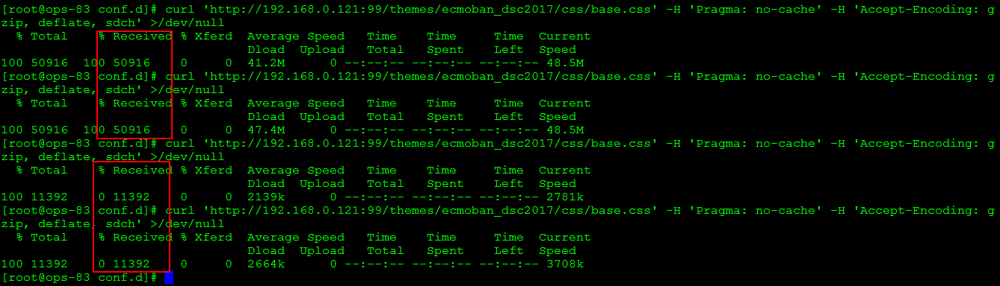
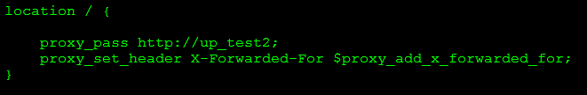
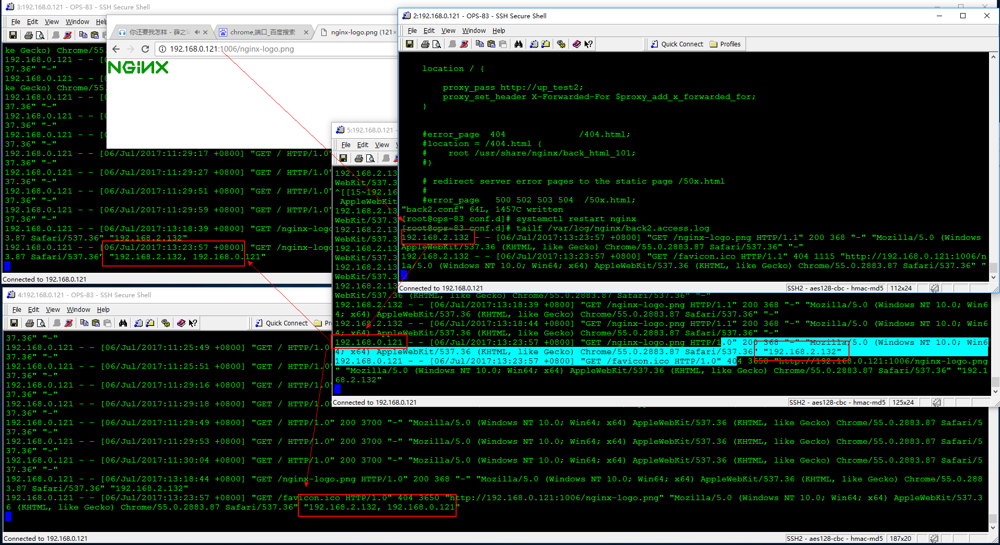

# Nginx
## Nginx常用命令
```
nginx -t        #检查配置文件
nginx -s reload #重新载入配置文件
curl -I www.baidu.com
```
## 搭建虚拟主机步骤
1. 增加一个完整的server标签段到结尾处
2. 更改server_name及对应的root根目录
3. 创建server_name域对应的网页根目录，并建立测试文件
4. 检查nginx配置语法，平滑重启
5. 做host解析或DNS解析
6. 浏览器输入网址、curl、wget进行检查

## 主配置文件nginx.conf
```
Nginx配置段
//全局区
Worker_processes 1 ;//有1个工作的子进程，可以进行修改，意义不大，需要争抢CPU资源，一般设置为cpu核心数（cpu*单颗核心）

Event{
//一般是配置nginx链接特性
//如1个work能同时允许多少连接
Worker_connections 1024;//是指一个子进程最大允许连1024个链接
}

http{//配置http服务器的主要段
	server {//这是虚拟主机段
		location{//定位，把特殊的路径或文件再次定位，如image目录单独处理，
			//如php单独处理
    }
  }
}
```


## Nginx虚拟主机配置
### 基于域名的虚拟机
```
server{
  listen  80;
  server_name www.bacd.com;
  location /{
    root html/www;
    index index.html index.htm;
  }
}

server{
  listen  80;
  server_name bbs.bacd.com;
  location /{
    root html/bbs;
    index index.html index.htm;
  }
}

server{
  listen  80;
  server_name chat.bacd.com;
  location /{
    root html/chat;
    index index.html index.htm;
  }
}

```
### 基于端口的虚拟机
```
server{
  listen  80;
  server_name www.bacd.com;
  location /{
    root html/www;
    index index.html index.htm;
  }
}

server{
  listen  81;
  server_name bbs.bacd.com;
  location /{
    root html/bbs;
    index index.html index.htm;
  }
}
```
### 基于IP的虚拟机
```
server{
  listen  10.0.0.10:80;
  server_name www.bacd.com;
  location /{
    root html/www;
    index index.html index.htm;
  }
}

server{
  listen  10.0.0.11:80;
  server_name bbs.bacd.com;
  location /{
    root html/bbs;
    index index.html index.htm;
  }
}
```


### 重启nginx后的检测

### Nginx 监控
```
location /nginx_status{
	stub_status on;
	access_log off;
	allow 10.0.0.0/24;
	deny allow;
}
```
```
server:启动nginx到现在共处理的连接数
accepts:启动nginx到现在创建的握手数
请求丢失数=握手数-连接数
handled requests:表述共处理请求数
reading：读取到客户端的header信息数
writing:返回给客户端的header信息数
waiting：nginx已经处理完正在等候下一次请求指令的驻留连接。开启keepalive的情况下，这个值等于active-（reading+writing）
```
**为了安全，这个状态要防止被外部用户看到**
## 集成php环境
[配置php环境](../php/php-win.md)，修改nginx.conf,支持php
```
# pass the PHP scripts to FastCGI server listening on 127.0.0.1:9000

location ~ \.php$ {
    root           html;
    fastcgi_pass   127.0.0.1:9000;
    fastcgi_index  index.php;
    fastcgi_param  SCRIPT_FILENAME  D:/app/nginx-1.12.1/html$fastcgi_script_name;
    include        fastcgi_params;
}
```
`nginx.conf`中`fastcgi_param  SCRIPT_FILENAME  /scripts$fastcgi_script_name`修改为`fastcgi_param  SCRIPT_FILENAME  D:\app\nginx-1.12.1\html$fastcgi_script_name;`不能访问，提示‘No input file specified’，nginx access.log中出现404，将`\`替换为`/  `正常，`fastcgi_param  SCRIPT_FILENAME  D:/app/nginx-1.12.1/html$fastcgi_script_name`。

编辑index.php文件
```
<?php phpinfo(); ?>
```
执行命令`nginx -s reload`

访问http://localhost/phpinfo.php查看是否可以打开phpinfo页面


## 虚拟主机的别名配置
`server_name`可以添加多个主机名，别名之间用空格分隔
```
server{
  listen  10.0.0.11:80;
  server_name bbs.bacd.com b.abcd.com abcd.com;
  location /{
    root html/bbs;
    index index.html index.htm;
  }
}
```
>集群中多个服务器提供相同的服务，通过前端负载进行分发，为了对每个主机进行检测，可以使用别名分别进行监测
>```
>    ...
>    server_name www.bacd.com www1.abcd.com;
>    ...
>    server_name www.bacd.com www2.abcd.com;
>    ...
>```

## Nginx 日志
### Nginx error_log
`error_log logs/error.log [debug|info|crit|alert|emerg]`

可以设置的标签段为

`#content:main,http,server,location`

### Nginx access_log

**Module:** ngx_http_log_module

http://nginx.org/en/docs/http/ngx_http_log_module.html

`access_log logs/access.log main`

### Nginx 日志切割

1. 创建脚本`runlog.sh`
```
#!/bin/bash
LOGPATH=/usr/local/nginx/logs/abcd.com.access.log
BASEPATH=/data

bak=$BASEPATH/$(date -d yesterday +%Y%m%d%H%M).abcd.com.access.log

mv $LOGPATH $bak
touch $LOGPATH
kill -USR1 `cat /usr/local/nginx/logs/nginx.pid`
```
或者使用`nginx -s reload` 替换kill -USR1 \`cat /usr/local/nginx/logs/nginx.pid\`

2. 添加计划任务（每分钟执行一次）

    `crontab -e`添加计划任务

    `*/1 * * * * sh /data/runlog.sh >/dev/null 2>&1`

    `crontab -l` 查看计划任务

## location
### location语法
```
location[=|~|~*|^~|@] uri{
	...
}
```
```
=：精确匹配
~:大小写敏感匹配
~*:不区分大小写
!：取反
^~:不做正则检查，常规检查
@：
```
### location 测试

```
server {
    listen       1006;
    server_name 192.168.0.121;

    location = / {
        return 401;
    }

    location / {
        return 402;
    }

    location /documents/ {
        return 403;
    }

    location ^~ /images/ {
        return 404;
    }

    location ~* \.(gif|jpg) {
        return 500;
    }

}
```
`curl -s -o /dev/null -I -w "%{http_code}\n" http://192.168.0.121:1006/`
```
[root@ops-83 conf.d]# curl -s -o /dev/null -I -w "%{http_code}\n" http://192.168.0.121:1080
401
[root@ops-83 conf.d]# curl -s -o /dev/null -I -w "%{http_code}\n" http://192.168.0.121:1080/
401
[root@ops-83 conf.d]# curl -s -o /dev/null -I -w "%{http_code}\n" http://192.168.0.121:1080/abc
402
[root@ops-83 conf.d]# curl -s -o /dev/null -I -w "%{http_code}\n" http://192.168.0.121:1080/documents
402
[root@ops-83 conf.d]# curl -s -o /dev/null -I -w "%{http_code}\n" http://192.168.0.121:1080/documents/
403
[root@ops-83 conf.d]# curl -s -o /dev/null -I -w "%{http_code}\n" http://192.168.0.121:1080/documents/abc
403
[root@ops-83 conf.d]# curl -s -o /dev/null -I -w "%{http_code}\n" http://192.168.0.121:1080/images/
404
[root@ops-83 conf.d]# curl -s -o /dev/null -I -w "%{http_code}\n" http://192.168.0.121:1080/IMAGES/
402
[root@ops-83 conf.d]# curl -s -o /dev/null -I -w "%{http_code}\n" http://192.168.0.121:1080/images/abc.jpg
404
[root@ops-83 conf.d]# curl -s -o /dev/null -I -w "%{http_code}\n" http://192.168.0.121:1080/images/ABC.JPG
404
[root@ops-83 conf.d]# curl -s -o /dev/null -I -w "%{http_code}\n" http://192.168.0.121:1080/abc.jpg
500
[root@ops-83 conf.d]# curl -s -o /dev/null -I -w "%{http_code}\n" http://192.168.0.121:1080/abc.JPG
500
[root@ops-83 conf.d]#
```
```
/:默认匹配
=:优先，和顺序无关
^~ 和 ~*：有限匹配^~
```

## rewrite
### rewrite语法
### rewrite示例
```
server {
    listen       1006;
    server_name www.abcd.com abcd.com;

    location = / {
        rewrite ^/(.*) http://www.xx.com/$1 permanent;
    }
}
```
`$1`后向引用,`permanent`永久跳转，类似301。

url重写
```
location /cathtml{
		root /ecmoban/www;
		index index.php index.html index.html;
		#rewrite "cathtml-(\d{1,7}).html" "/category.php?id=(\d{1,7})";
		rewrite "cathtml-(\d+).html" /category.php?id=$1;
}
location /goods{
		root /ecmoban/www;
		index index.php index.html index.html;
		rewrite "goods-(\d+).html" /goods.php?id=$1;
}
```
`(\d+)`，为任意个数字，`$1`为后向引用，前面匹配的可以在后面直接调用

## nginx访问认证
### 配置文件修改
```
location /{
	auth_basic	"xxxx";
	auth_basic_user_file conf/htpasswd;
}
```
使用位置：http/server/location/limit_except

### 生成密码文件
可以使用apache自带的“htpasswd ”或“openssl passwd”设置。

```
# htpasswd -bc /etc/nginx/conf/htpasswd wanghui 1234567
# chmod /etc/nginx/conf/htpasswd
# chown nginx /etc/nginx/conf/htpasswd
```
重新加载生效
```
# nginx -t
# nginx -s reload
```
## nginx 的目录浏览
### autoindex
```
server{
  listen  10.0.0.11:80;
  server_name bbs.bacd.com b.abcd.com abcd.com;
  location /{
    root html/bbs;
		autoindex on;
    index index.html index.htm;
  }
}
```

## 提升网站性能
### 启用nginx 压缩

查看nginx中文件类型准确写法mime.types，可以放置在http、server、location段的位置
```
		gzip on;
    gzip_buffers 32 4k;
    gzip_comp_level 6;
    gzip_min_length 20;
    gzip_types text/css text/xml application/x-javascript;
```
对比测试结果:\
`curl 'http://192.168.0.121:99/themes/ecmoban_dsc2017/css/base.css' -H 'Pragma: no-cache' -H 'Accept-Encoding: gzip, deflate, sdch' >/dev/null`



### expires缓存
通过正则表达式对.jpg/.js/.png/.gif进行缓存，没有缓存的css就没有过期时间。同时需要注意正则表达式写法，如果gif后有“|”，则要匹配一个空字符串，相当于所有的都能匹配上了。
```
location ~ \.(jpg|js|png|gif){
        expires 1d;
        root /ecmoban/www;
    }
```

### 负载均衡

```
[root@ops-83 conf.d]# grep -v '#' back-101.conf
server {
    listen       1001;
    server_name  _;
    access_log  /var/log/nginx/101.access.log  main;
    location / {
        root   /usr/share/nginx/back_html_101;
        index  index.php index.html index.htm;
    }
    error_page  404              /404.html;
    location = /404.html {
        root /usr/share/nginx/back_html_101;
    }
    error_page   500 502 503 504  /50x.html;
    location = /50x.html {
        root /usr/share/nginx/back_html_101;  
    }
    location ~ \.php$ {
        root           /ecmoban/www;
        fastcgi_pass   127.0.0.1:9000;
        fastcgi_index  index.php;
        fastcgi_param  SCRIPT_FILENAME $document_root$fastcgi_script_name;
        include        fastcgi_params;
    }
}
```
```
[root@ops-83 conf.d]# grep -v '#' back-102.conf
server {
    listen       1002;
    server_name  _;
    access_log  /var/log/nginx/102.access.log  main;
    location / {
        root   /usr/share/nginx/back_html_102;
        index  index.php index.html index.htm;
    }
    error_page  404              /404.html;
    location = /404.html {
        root /usr/share/nginx/back_html_101;
    }
    error_page   500 502 503 504  /50x.html;
    location = /50x.html {
        root /usr/share/nginx/back_html_101;  
    }
    location ~ \.php$ {
        root           /ecmoban/www;
        fastcgi_pass   127.0.0.1:9000;
        fastcgi_index  index.php;
        fastcgi_param  SCRIPT_FILENAME $document_root$fastcgi_script_name;
        include        fastcgi_params;
    }
}
```
```
[root@ops-83 conf.d]# grep -v '#' back.conf
upstream  up_test{
    server 192.168.0.121:1001;
    server 192.168.0.121:1002;
}

server {
    listen       1005;
    server_name  _;
    gzip on;
    gzip_buffers 32 4k;
    gzip_comp_level 6;
    gzip_min_length 20;
    gzip_types text/css text/xml application/x-javascript;
    access_log  /var/log/nginx/back.access.log  main;
    location / {
        proxy_pass http://up_test;
    }
}
```
在经过负载均衡后，客户端源ip将丢失，为了准确获得源ip，需要增加参数`proxy_set_header X-Forwarded-For $proxy_add_x_forwarded_for`。本次测试由1006端口（代理）->1005（代理）->(1001、1002)，最终实现1005日志中记录了源ip（客户端），1001、1002中记录了源ip（客户端）及二级代理ip（1005）。
 \
 
