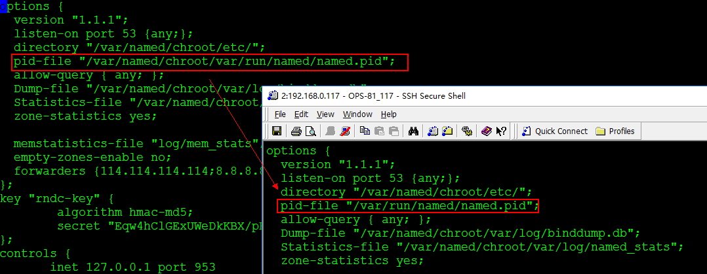

# DNS
***
## DNS概述
### 解析过程
1. 检查DNS缓存，若查到请求地址的名字，即向客户机发出响应信息
2. 若没有查到，则在数据库中查找，若查到地址或名字，即向客户机发出响应信息
3. 若没有查到，则请求根DNS服务器，并依次从根、定级、二级查找，直至找到，即向客户机发出响应信息
4. 若没有找到，返回错误信息

### 一些概念
FQDN (Full Qualified Domain Name) –> IP : 正向解析\
IP –> FQDN：反向解析 \
递归：DNS请求被服务器接收后，如果属于此服务器管辖范围则请求上级服务器依次传递请求，并且依次传递结果给发出请求的主机。客户机指向的服务器一定给递归服务。  \
迭代： DNS请求被服务器接收后，如果不是自己管辖范围，让客户端访问根域服务器，然后跟域通知客户端去访问下级服务器，直到最后客户端访问管辖请求域名的服务器为止。\

域（Domain）：逻辑概念\
区域（zone）：物理概念，特指存储资源记录的硬件设备，如文本文件，或者数据库\
正向区域和反向区域域不能存储在一个文件或者数据库中，由于解析技术不同 \

### DNS的分类
* 主DNS
* 从DNS
* 缓存服务器
* 转发器

### DNS中记录类型
* SOA:可以理解为dns做备注的说明文本，一般与ns一致
* NS：域名授权名称服务器
* MX:域的邮件交换器，要跟一个优先级值，越小越高
* A：ipv4主机地址
* AAAA:ipv6主机地址
* PTR:解析IP的指针，反向记录
* CNAME：权威名称，定义别名记录

### DNS命名规范
1. 26个英文字母
2. 数字
3. “-”
4. 最多63字节长度

### 常用命令
**host**

    ```
    [root@ops-82 etc]# host baidu.com
    baidu.com has address 220.181.57.217
    baidu.com has address 111.13.101.208
    baidu.com has address 180.149.132.47
    baidu.com has address 123.125.114.144
    baidu.com mail is handled by 10 mx.n.shifen.com.
    baidu.com mail is handled by 20 mx50.baidu.com.
    baidu.com mail is handled by 20 mx1.baidu.com.
    baidu.com mail is handled by 20 jpmx.baidu.com.
    ```

**dig**

```
[root@ops-82 etc]# dig admin.abcd.tax

; <<>> DiG 9.9.4-RedHat-9.9.4-50.el7_3.1 <<>> admin.abcd.tax
;; global options: +cmd
;; Got answer:
;; ->>HEADER<<- opcode: QUERY, status: NOERROR, id: 4732
;; flags: qr aa rd ra; QUERY: 1, ANSWER: 1, AUTHORITY: 1, ADDITIONAL: 2

;; OPT PSEUDOSECTION:
; EDNS: version: 0, flags:; udp: 4096
;; QUESTION SECTION:
;admin.abcd.tax.                        IN      A

;; ANSWER SECTION:
admin.abcd.tax.         3600    IN      A       192.168.2.31

;; AUTHORITY SECTION:
abcd.tax.               3600    IN      NS      ns1.abcd.tax.

;; ADDITIONAL SECTION:
ns1.abcd.tax.           3600    IN      A       192.168.0.119

;; Query time: 1 msec
;; SERVER: 192.168.0.119#53(192.168.0.119)
;; WHEN: Tue Aug 01 14:01:01 CST 2017
;; MSG SIZE  rcvd: 93

[root@ops-82 etc]#
```

**nslookup**

```
[root@ops-82 etc]# nslookup admin.abcd.tax
Server:         192.168.0.119
Address:        192.168.0.119#53

Name:   admin.abcd.tax
Address: 192.168.2.31

[root@ops-82 etc]#
```

***
## 部署bind
### yum安装
1. yum 安装
`yum install bind-utils bind bind-devel bind-chroot`

2. 检查rpm包：

    `rpm -qa|grep bind`

3. 查看本机DNS
    ```
    [root@ops-82 etc]# cat /etc/resolv.conf
    # Generated by NetworkManager
    search box.cn
    #nameserver 8.8.8.8
    nameserver 192.168.0.119
    [root@ops-82 etc]#
    ```
4. 编辑/etc/named.conf,主配置文件
    ```
    [root@ops-82 etc]# cat /etc/named.conf
    options {
      version "1.1.1";
      listen-on port 53 {any;};
      directory "/var/named/chroot/etc/";
      pid-file "/var/run/named/named.pid";
      allow-query { any; };
      Dump-file "/var/named/chroot/var/log/binddump.db";
      Statistics-file "/var/named/chroot/var/log/named_stats";
      zone-statistics yes;

      memstatistics-file "log/mem_stats";
      empty-zones-enable no;
      forwarders {114.114.114.114;8.8.8.8; };
    };
    key "rndc-key" {
            algorithm hmac-md5;
            secret "Eqw4hClGExUWeDkKBX/pBg==";
    };
    controls {
           inet 127.0.0.1 port 953
                   allow { 127.0.0.1; } keys { "rndc-key"; };
    };
    logging {
      channel warning {
        file "/var/named/chroot/var/log/dns_warning" versions 10 size 10m;
        severity warning;
        print-category yes;
        print-severity yes;
        print-time yes;
      };
      channel general_dns {
        file "/var/named/chroot/var/log/dns_log" versions 10 size 100m;
        severity info;
        print-category yes;
        print-severity yes;
        print-time yes;
      };
      category default {
        warning;
      };
      category queries {
        general_dns;
      };
    };
    include "/var/named/chroot/etc/view.conf";
    [root@ops-82 etc]#
    ```
    chroot目录，是bind的一个安全机制，假根

    状态文件：

    `Statistics-file "/var/named/chroot/var/log/named_stats";`

    **监控的话可以重点看namd_stats文件`**

    内存状态文件：
    `memstatistics-file "log/mem_stats";`

    日志文件：

    * `Channel warning`:警告日志

    * `channel general_dns`:访问日志

    `named.conf`文件中给rndc定义key：

    ```
    key "rndc-key" {
            algorithm hmac-md5;
            secret "Eqw4hClGExUWeDkKBX/pBg==";
    };
    ```

5. 编辑/etc/rndc.key
    ```
    [root@ops-82 etc]# cat /etc/rndc.key
    key "rndc-key" {
            algorithm hmac-md5;
            secret "Eqw4hClGExUWeDkKBX/pBg==";
    };
    [root@ops-82 etc]#
    ```

6. 编辑/etc/rndc.conf

      用哪个key去哪台机器连哪个端口，同named.conf中配置对应。
    ```
    [root@ops-82 etc]# cat /etc/rndc.conf
    key "rndc-key" {
            algorithm hmac-md5;
            secret "Eqw4hClGExUWeDkKBX/pBg==";
    };
    options {
            default-key "rndc-key";
            default-server 127.0.0.1;
            default-port 953;
    };
    [root@ops-82 etc]#
    ```

7. 编辑/var/named/chroot/etc/view.conf
    ```
    [root@ops-82 etc]# cat /var/named/chroot/etc/view.conf
    view "View" {
      zone "abcd.tax" {
            type    master;
            file    "abcd.tax.zone";
            allow-transfer {
                    192.168.0.121;
            };
            notify  yes;
            also-notify {
                    192.168.0.121;
            };
      };
    };
    [root@ops-82 etc]#
    ```
    `Zone`：为哪个域进行解析 \
    `Type`：类型 \
    `File`：指定zong文件，路径默认为同级目录 \
    `Allow-transfer`： 允许谁来数据同步 \
    `Also-notify`： 通知谁该向我这里同步\
    所指定的IP可以作为本master dns的slave

8. 编辑/var/named/chroot/etc/abcd.tax.zone
    ```
    [root@ops-82 etc]# cat /var/named/chroot/etc/abcd.tax.zone
    $ORIGIN .
    $TTL 3600       ;
    abcd.tax           IN SOA  ns1.abcd.tax. ns2.abcd.tax.(
                                    2002       ; serial
                                    900        ; refresh (15 minutes)
                                    600        ; retry (10 minutes)
                                    86400      ; expire (1 day)
                                    3600       ; minimum (1 hour)
                                    )
                            NS      ns1.abcd.tax.
    $ORIGIN abcd.tax
    ns1     A       192.168.0.119
    ns2     A       192.168.0.121
    2w              A       192.168.0.121
    3w              A       192.168.0.119
    admin   A       192.168.2.31
    [root@ops-82 etc]#
    ```
    **注意：** 必须配置`ns1`解析记录，否则系统无法找到dns

    ```
    $ORIGIN 变量，引用哪个域，“.”为当前不引用其他域，如果不配，默认引用view中配置的zone
    $TTL server端缓存时间，秒
    Serial 序列号，每次修改完dns需增加，以使dns能够判断出修改了，以进行同步，实际配置时可以配置为时间戳；
    Refresh：同步刷新间隔；
    Retry：失败后隔多长时间重试；
    Expire：超过该时间后认为dns服务不可用
    NS:ns地址，域名服务商处配置，如万网，让其他人知道该域名由谁进行解析
    A记录解析，首先要配置自己ns记录的解析，否则别人无法找到dns服务器
    ```

9. 涉及文件

    **全局文件：**
    ```
    /etc/name.conf
    /etc/rndc.key
    /etc/rndc.conf
    /var/named/chroot/etc/view.conf
    ```
    **解析配置文件**
    ```
    /var/named/chroot/etc/abcd.tax.zone
    ```
10. 修改权限及重启
修改目录权限：`cd /var && chown -R named.named named/`
重启：`systemctl restart named`
>启动失败，不能写入pid文件，重新进行了授权，后来又报出pid文件不可读,经查是个bug
https://unix.stackexchange.com/questions/116725/pid-file-var-run-named-named-pid-not-readable-yet-after-start


***
## bind 配置slave
### 安装及编辑相同文件（同master一样）
1. 安装yum install bind-utils bind bind-devel bind-chroot
2. 编辑/etc/named.conf
3. 编辑/etc/rndc.key
4. 编辑/etc/nrdc.conf

### 编辑单独文件
编辑/var/named/chroot/etc/view.conf

```
[root@ops-83 etc]# vim view.conf
view "SlaveView" {
  zone "tax861.gov.test" {
        type    slave;
        masters {192.168.0.119;};
        file    "slave.abcd.gov.cn.zone";
  };
  zone "tax862.gov.cn" {
        type    slave;
        masters {192.168.0.119;};
        file    "slave.abcd2.gov.cn.zone";
  };
  zone "abcd.tax" {
        type    slave;
        masters {192.168.0.119;};
        file    "slave.abcd.tax.zone";
  };
};
```

### 同步
1. 修改master上view.conf配置，将slave节点IP加入
2. 修改master上zone文件中serial+1
3. 修改slave目录权限`cd /var && chown -R named.named named/`
4. 启动slave bind服务`systemctl start named`
5. 重载master bind服务`rndc reload`

>日常同步修改完master上zone文件后，修改serial值+1，执行重载命令`rndc reload`

***
## DNS添加
针对dns操作后，需要执行`rndc reload`

### A记录
```
ns1     A       192.168.0.119
ns2     A       192.168.0.121
2w              A       192.168.0.121
3w              A       192.168.0.119
admin   A       192.168.2.31
```
```
[root@ops-82 etc]# host admin.abcd.tax
admin.abcd.tax has address 192.168.2.31
[root@ops-82 etc]# host admin.abcd.tax 192.168.0.119
Using domain server:
Name: 192.168.0.119
Address: 192.168.0.119#53
Aliases:

admin.abcd.tax has address 192.168.2.31
[root@ops-82 etc]# host admin.abcd.tax 192.168.0.121
Using domain server:
Name: 192.168.0.121
Address: 192.168.0.121#53
Aliases:

admin.abcd.tax has address 192.168.2.31
```
### CNAME
```
cname   CNAME   admin.abcd.tax.
```
```
[root@ops-82 etc]# host cname.abcd.tax 192.168.0.119
Using domain server:
Name: 192.168.0.119
Address: 192.168.0.119#53
Aliases:

cname.abcd.tax is an alias for admin.abcd.tax.
admin.abcd.tax has address 192.168.2.31
[root@ops-82 etc]# host cname.abcd.tax 192.168.0.121
Using domain server:
Name: 192.168.0.121
Address: 192.168.0.121#53
Aliases:

Host cname.abcd.tax not found: 3(NXDOMAIN)
[root@ops-82 etc]#
```
>121没有做DNS数据同步，造成cname无法解析
### MX记录
```
mx   MX   5 192.168.0.101
```
>MX优先级设置为5
### PTR记录
>ptr记录有问题，暂时没有调通
1. 编辑master节点view.conf文件，加入ptr的zone配置
    ```
    zone "168.192.in-addr.arpa" {
          type    master;
          file    "168.192.zone";
          allow-transfer {
                  192.168.0.121;
          };
          notify  yes;
          also-notify {
                  192.168.0.121;
          };
    };
    ```
2. 编辑master节点168.192.zone文件

---
## 清除DNS缓存
### Windows
```
ipconfig /flushdns
```

### Linux


### chrome
* 查看缓存:`chrome://dns/`
* 清除Chrome浏览器的DNS缓存

  在地址栏中输入: `chrome://net-internals/#dns`，然后点"Clear host cache"按钮。
* 清除套接字缓存:

  在地址栏中输入: `chrome://net-internals/#sockets`，然后点"Clear idle sockets"按钮和"Flush socket pools"按钮。

* 清除浏览缓存

  有时候还需要清除浏览缓存。在地址栏中输入: `chrome://settings/clearBrowserData`，选择"浏览记录"和"缓存的图片和文件"两项内容，点"清除浏览缓存"按钮。


  ---
## 通过nginx反向代理对dns进行负载均衡
```
  stream {
    upstream dns_servers {
        least_conn;
        server 192.168.0.119:53;
        server 192.168.0.121:53;
    }
    server {
        listen     53 udp;
        proxy_pass dns_servers;
    }
  }
```
