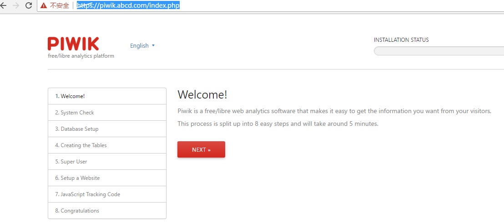
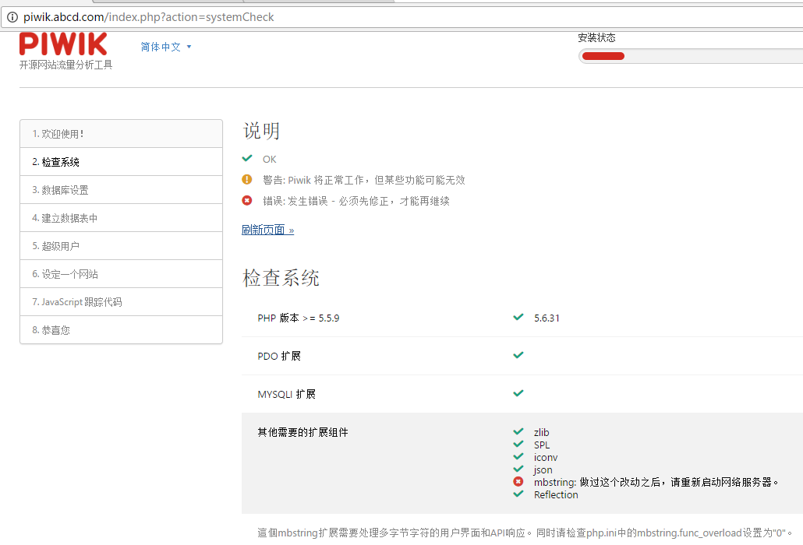
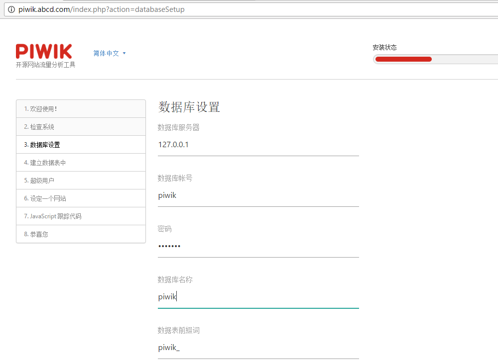
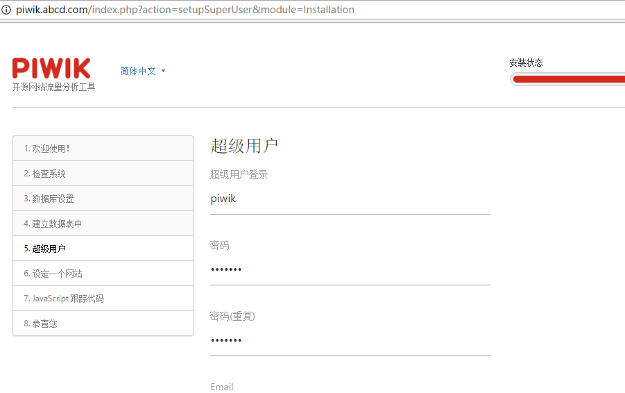
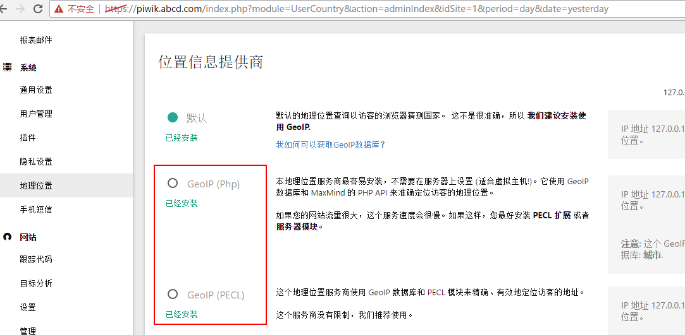

# piwik部署
## 下载
http://php.net/downloads.php

http://nginx.org/

https://piwik.org/

## 环境准备
[搭建nginx+php环境](../../02-网站服务/nginx/nginx.md)

[搭建mysql环境](../../03-数据库/mysql/mysql-win.md)

## 部署
### 解压至piwik至发布目录
`D:\app\piwik`

### 修改hosts文件
配置hosts文件`127.0.0.1  piwik.abcd.com`

### 修改nginx.conf文件
```
#HTTPS server

server {
    listen       443 ssl;
    server_name  piwik.abcd.com;

    ssl_certificate      keys/abcd.crt;
    ssl_certificate_key  keys/abcd_nopass.key;

    ssl_session_cache    shared:SSL:1m;
    ssl_session_timeout  5m;

    ssl_ciphers  HIGH:!aNULL:!MD5;
    ssl_prefer_server_ciphers  on;

    location / {
        root   D:/app/piwik;
        index  index.html index.htm index.php;
    }
    location ~ \.php$ {
        root           html;
        fastcgi_pass   127.0.0.1:9000;
        fastcgi_index  index.php;
        fastcgi_param  SCRIPT_FILENAME  D:/app/piwik$fastcgi_script_name;
        include        fastcgi_params;
    }
}
```
### mysql 配置
```
mysql -uroot -p
create database piwik;
create user 'piwik'@'%' identified by 'wanghui';
grant all on piwik.* to 'piwik'@'localhost' identified by 'wanghui';
grant all on piwik.* to 'piwik'@'%' identified by 'wanghui';
```

### 配置piwik
1. 访问`https://piwik.abcd.com/index.php`

2. 检查系统
按照检查配置进行修改

检查中提示`mbstring.func_overload设置为"0"`，同时需要设置 `extension=php_mbstring.dll`,否则不会生效。其他系统如下：
```
windows平台：
修改php.ini文件，去掉 ;extension=php_mbstring.dll 前面的分号。
unix平台：
打开/etc/php.ini
把 ;extension=php_mbstring.so 改成 extension=php_mbstring.so 。
```
3. 配置数据库

4. 设置超级用户

5. 设定站点
6. 生成跟踪代码
```
<!-- Piwik -->
<script type="text/javascript">
  var _paq = _paq || [];
  /* tracker methods like "setCustomDimension" should be called before "trackPageView" */
  _paq.push(['trackPageView']);
  _paq.push(['enableLinkTracking']);
  (function() {
    var u="//piwik.abcd.com/";
    _paq.push(['setTrackerUrl', u+'piwik.php']);
    _paq.push(['setSiteId', '1']);
    var d=document, g=d.createElement('script'), s=d.getElementsByTagName('script')[0];
    g.type='text/javascript'; g.async=true; g.defer=true; g.src=u+'piwik.js'; s.parentNode.insertBefore(g,s);
  })();
</script>
<!-- End Piwik Code -->
```
### 更新geoip地址库
#### 下载geoip地址库
http://geolite.maxmind.com/download/geoip/database/GeoLiteCity.dat.gz

解压缩，重命名为`GeoIPCity.dat`，拷贝至`D:\app\piwik\misc`。

#### 下载windows版本gphp_eoip.dll
http://windows.php.net/downloads/pecl/releases/geoip/1.1.1/

解压缩后，拷贝`php_geoip.pdb`、`php_geoip.dll`至`D:\app\php-5.6.31-nts-Win32-VC11-x64\ext`。

>PECL扩展
>
>`http://windows.php.net/downloads/pecl/releases/`

#### 配置php.ini
```
extension=php_geoip.dll
[geoip]
geoip.custom_directory = D:\\app\\piwik\\misc
```
重启php
`D:\app>D:\app\php-5.6.31-nts-Win32-VC11-x64\php-cgi.exe -b 127.0.0.1:9000 -c D:\app\php-5.6.31-nts-Win32-VC11-x64\php.ini`
#### 选择Geoip库

